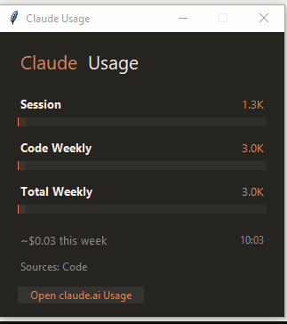

# Claude Session Monitor

A lightweight Windows system tray application that monitors your current Claude Code session token usage in real-time.



## Features

- **System tray icon** with dynamic color indicator based on session usage
- **Elegant glass-effect widget** with Claude's brand colors
- **Session token counter** - tracks tokens used in your current Claude Code session
- **Color-coded progress bar:**
  - Green (< 30%) → Lime (30-50%) → Yellow (50-70%) → Orange (70-85%) → Red (> 85%)
- **Quick access button** to open claude.ai usage page
- **Auto-refresh** every 30 seconds
- Compact, minimal design

## Installation

### Option 1: Run from source (requires Python)

1. Make sure you have Python 3.8+ installed
2. Clone or download this repository
3. Install dependencies:
   ```bash
   pip install pystray Pillow
   ```
4. Run the monitor:
   ```bash
   python claude_usage_monitor.py
   ```
   Or double-click `run.bat`

### Option 2: Download release (no Python needed)

Download the latest `ClaudeUsageMonitor.exe` from the [Releases](../../releases) page.

## Usage

- **Left-click** the tray icon to show/hide the widget
- **Right-click** the tray icon for menu (Refresh, Quit)
- Click **"Open claude.ai Usage"** to view your Max/Pro subscription usage in browser

## Auto-start with Windows

Run `add_to_startup.bat` to add the monitor to Windows startup.

## How it works

The monitor reads session data from Claude Code's local log files at `~/.claude/projects/` and counts the tokens used in your current session.

**Note:** Weekly/monthly subscription usage from claude.ai cannot be accessed locally - only Anthropic's servers track this. Use the "Open claude.ai Usage" button to check your actual subscription usage.

## Requirements

- Windows 10/11
- Python 3.8+ (if running from source)
- Dependencies: `pystray`, `Pillow`

## License

MIT License - feel free to use and modify.

## Credits

Built with Claude Code by Anthropic.
